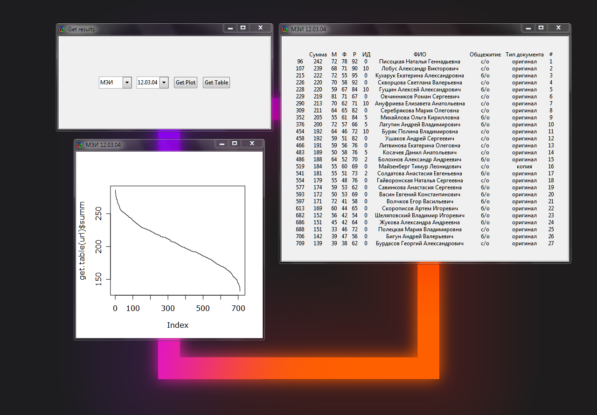

# abitu-table
Наглядное представление количества заявлений, поданных в различные технические ВУЗы в 2015 году

Поддерживаемые ВУЗы:
 - МАИ (факультеты #6 и #9)
 - МЭИ
 - МИРЭА

Необходимые библиотеки:
 - `XML`
 - `RGtk2`
 - `cairoDevice`
 - `ggplot2`
 - `gridExtra`
 - `httr`

Пример работы программы:

